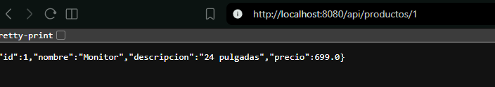
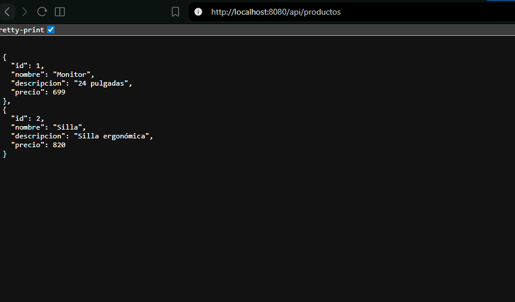
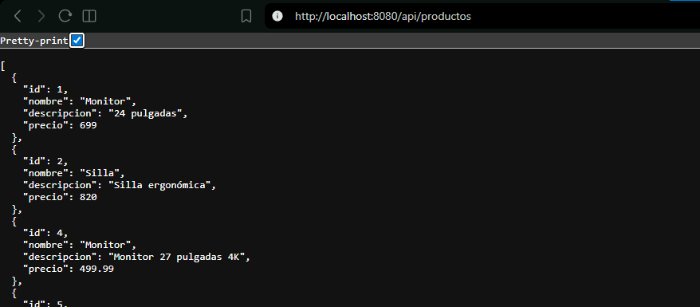
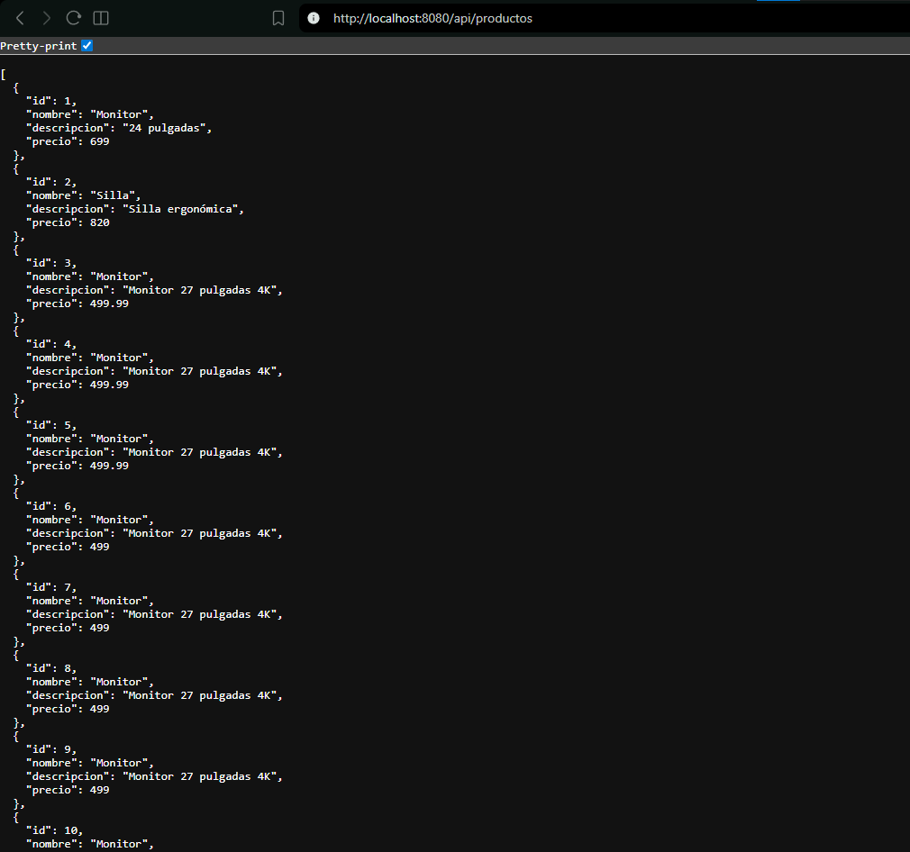
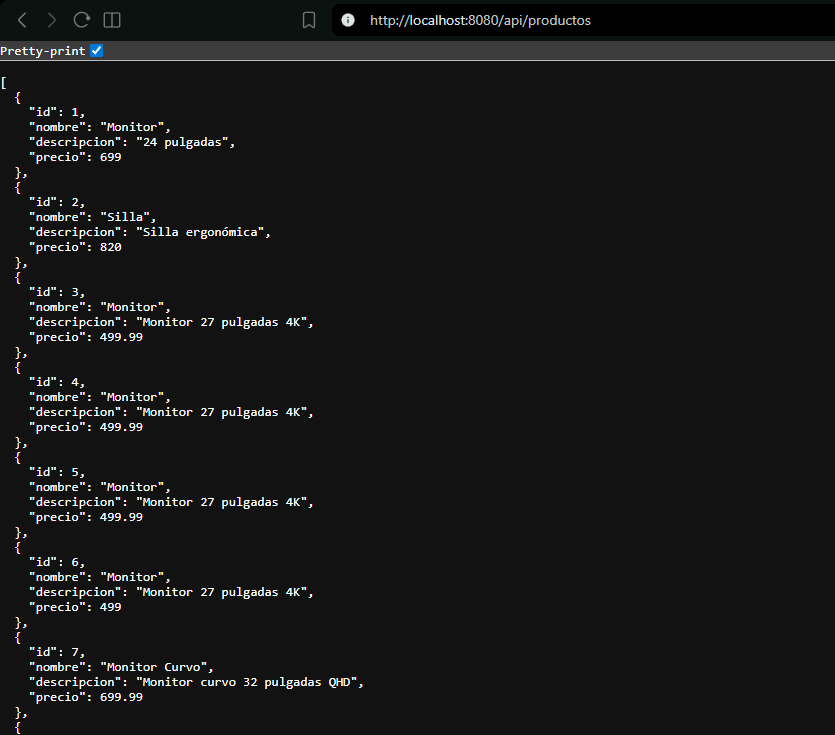

# daza-post2-u7

API REST CRUD de productos con Spring Boot, @RestController y ResponseEntity.

## Endpoints

- GET /api/productos
- GET /api/productos/{id}
- POST /api/productos
- PUT /api/productos/{id}
- DELETE /api/productos/{id}

## Códigos HTTP

- 200 OK en consultas y actualización exitosa
- 201 Created al crear
- 204 No Content al eliminar
- 404 Not Found cuando el recurso no existe

## Prerrequisitos

- JDK 17+
- Maven 3.8+

## Ejecución

1. mvn spring-boot:run
2. Probar en <http://localhost:8080/api/productos>

## Ejemplo de payload

{
  "nombre": "Tablet",
  "descripcion": "Tablet 10 pulgadas",
  "precio": 1200.0
}

## Capturas

*Captura de pantalla: GET /api/productos/1 mostrando un producto específico por ID.*

*Captura de pantalla: GET /api/productos listando todos los productos.*

*Captura de pantalla: DELETE /api/productos/1 con respuesta 204 No Content.*

*Captura de pantalla: POST /api/productos con nuevo producto creado (201 Created).* 

*Captura de pantalla: PUT /api/productos/1 actualizando un producto existente (200 OK).*
